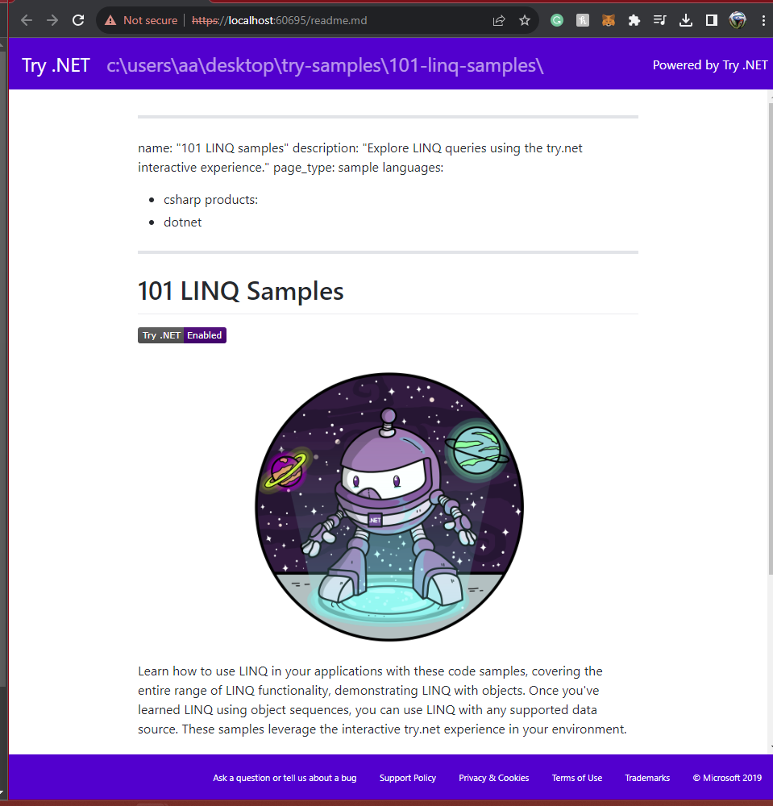

# LINQ-commands

### LINQ 101 samples from Try .NET ([source repository](https://github.com/dotnet/try-samples))

## Table of Contents
1. [Getting start with LINQ](#get_start)
2. [Sources](#sources)

<a id="get_start"></a>
## Getting start with LINQ
<details close>
<summary><b>(click to expand/hide)</b></summary>
<!-- MarkdownTOC -->
   
1. Install dotnet and dotnet-try tool
   - [link to install dotnet](https://dotnet.microsoft.com/en-us/download)
   - [link for guide for installing dotnet-try tool](https://github.com/dotnet/try/blob/main/DotNetTryLocal.md)
      - make sure to follow the step for installing older version .NET Core 3.0 SDK
      - make sure to use the command line below to install the dotnet-try tool
        ```bash
          dotnet tool install -g --add-source "https://pkgs.dev.azure.com/dnceng/public/_packaging/dotnet-tools/nuget/v3/index.json" Microsoft.dotnet-try
        ```
2. clone the [try-sample repository](https://github.com/dotnet/try-samples)
3. located to the try-sample repository and locate to the 101-linq-samples
   ```bash
    cd <path>/try-sample/101-linq-samples
   ```
   ```bash
    dotnet try
   ```
4. finally it should locate you to a localhost, please hit advanced if the page is blocked
   - you should see

     

<!-- /MarkdownTOC -->
</details>

<a id="sources"></a>
## Sources
<details open>
<summary><b>(click to expand/hide)</b></summary>
<!-- MarkdownTOC -->
   
- [try-sample repository](https://github.com/dotnet/try-samples)
- [dotnet installation](https://dotnet.microsoft.com/en-us/download)
- [dotnet-try guide](https://github.com/dotnet/try/blob/main/DotNetTryLocal.md)
- [linq videos tutorial c#201](https://www.youtube.com/watch?v=p5myHVOtmiU&list=PLdo4fOcmZ0oVxKLQCHpiUWun7vlJJvUiN&index=20)

<!-- /MarkdownTOC -->
</details>
